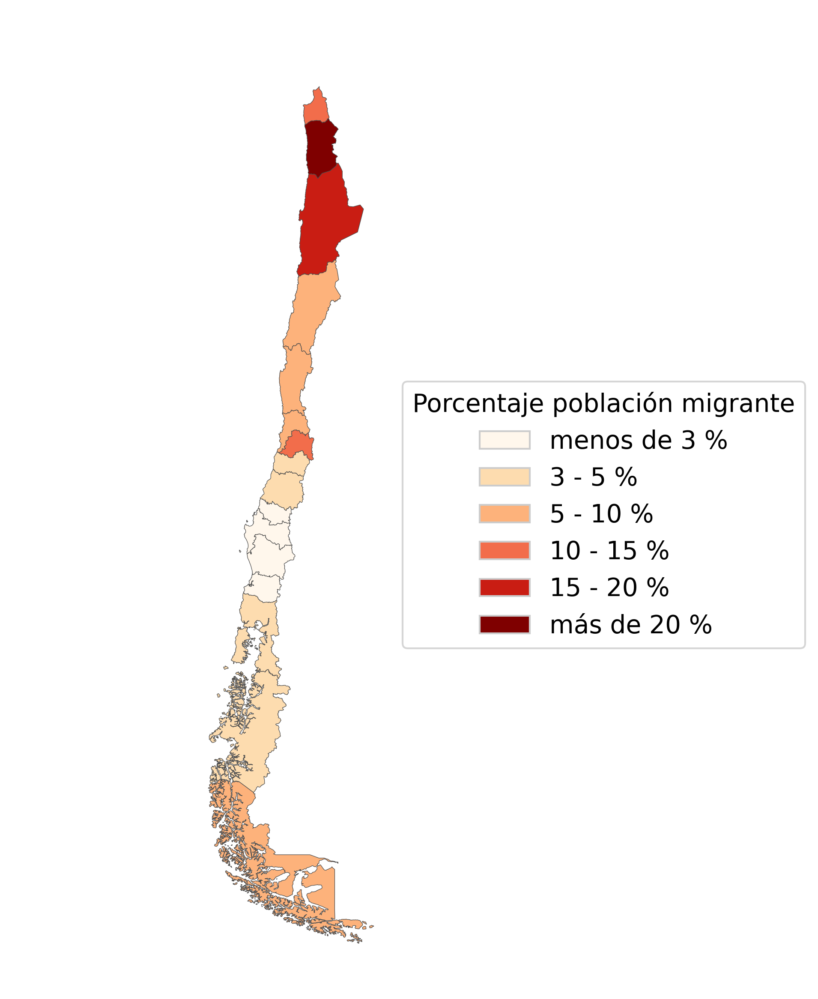
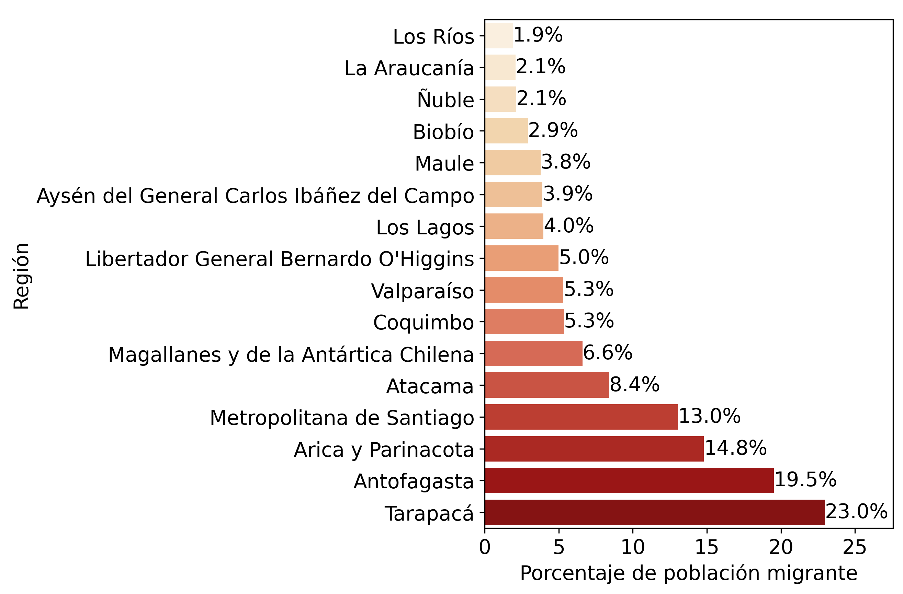
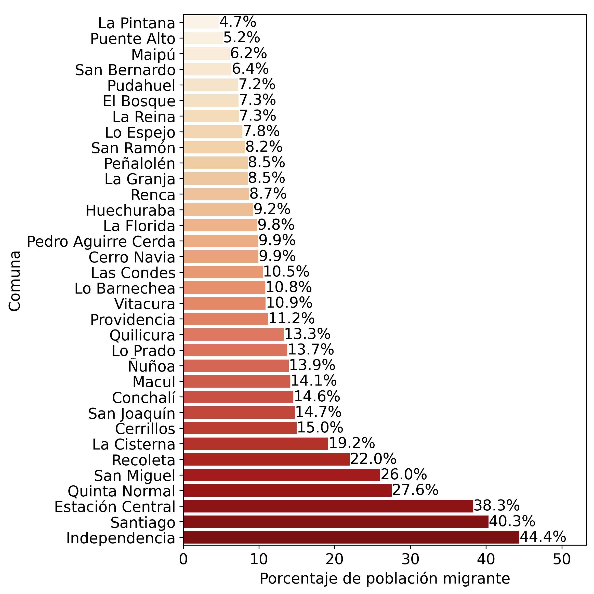
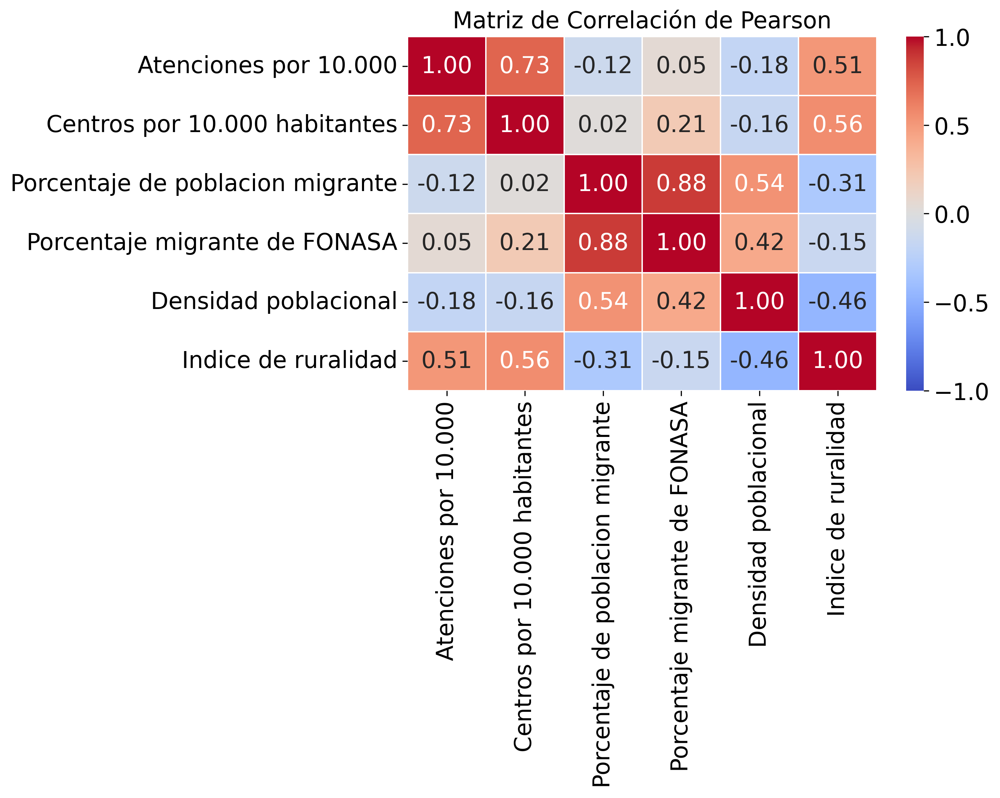
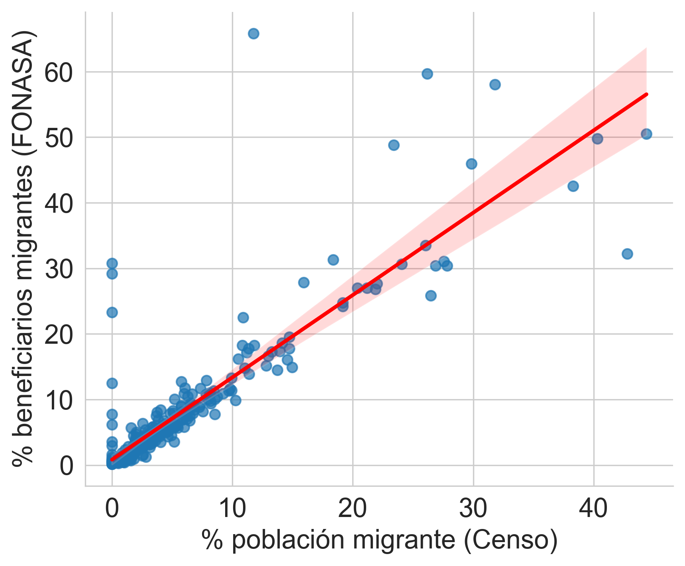
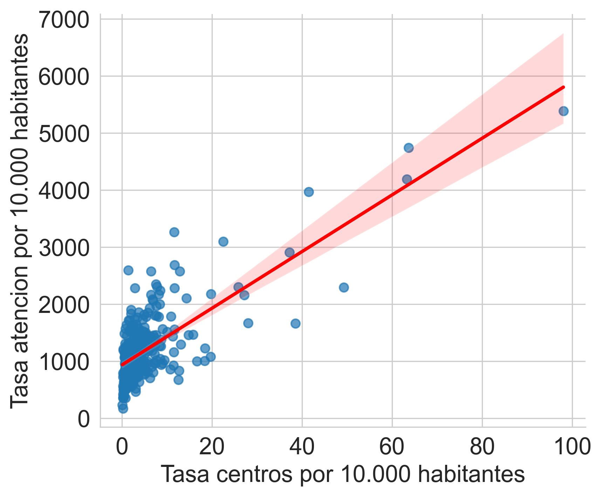

# Arquitectura para el Cruce de Datos de Migración y Salud Pública en Chile

> **Autor:** Alan Chávez
> **Año:** 2025

## Resumen del Proyecto

Este repositorio contiene el código fuente, los notebooks de análisis y la documentación técnica desarrollada para la memoria **"Arquitectura para el cruce de datos de migración y salud pública en Chile: Análisis basado en datos del Censo 2024"**.

El objetivo principal de esta investigación fue desarrollar una arquitectura de datos capaz de integrar fuentes demográficas (Censo/INE) con registros administrativos de salud (FONASA/DEIS) para evaluar el impacto real de la migración en la saturación del sistema de salud público.

### Hallazgos Principales
El análisis de datos permitió desmitificar narrativas comunes y validar dinámicas estructurales:
* **Validación Cruzada:** Se demostró una alta consistencia entre el Censo y los registros de FONASA ($\rho = 0.88$), validando el uso de datos administrativos para monitoreo intercensal.
* **Oferta Inducida:** La infraestructura disponible resultó ser un predictor mucho más fuerte de la tasa de atenciones ($\rho = 0.73$) que la presión demográfica.
* **Desmitificación:** No se encontró correlación significativa ($\rho = -0.12$) entre el % de población migrante comunal y la saturación del sistema.
* **Efecto de Ruralidad:** Se identificaron distorsiones estadísticas en zonas rurales debido a la normativa de cobertura (Norma Técnica N° 211), corregidas mediante el análisis territorial.

## Estructura del Repositorio

```text
├── data/
│   ├── raw/                # Datos brutos (INE, FONASA, DEIS)
│   └── processed/          # Datos limpios y cruzados (Master Table)
|
├── notebooks/
│   ├── exploratorio/               # Análisis descriptivo inicial
│   ├── calculos_preliminares/      # Validaciones y pruebas
│   ├── maestro/                    # generación de datasets consolidados
|   ├── mapas/                      # Scripts de visualización
|   └── regresion/                  # Modelamiento estadístico
|
├── figures/                
│   ├── pais/               # Visualizaciones a nivel país
|   └── regiones/           # Visualizaciones a nivel regional
|
├── .gitignore              # Archivos ignorados por git
├── README.md               # Descripción general del proyecto
└── requirements.txt        # Dependencias del proyecto
```

## Tecnologías Utilizadas
* Lenguaje: Python 3.13
* Librerías de Análisis: Pandas, NumPy
* Visualización: Matplotlib, Seaborn
* Análisis Geoespacial: GeoPandas
* Estadística: Statsmodels

## Instalación
* **Clonar el repositorio:**
```code
git clone [https://github.com/alanc26/memoria.git](https://github.com/alanc26/memoria.git)
cd memoria
```
* Crear un entorno virtual (recomendado):
```code
python -m venv venv
venv\Scripts\activate
```
* Instalar dependencias:
```code
pip install -r requirements.txt
```

## Obtencion de datos:

La arquitectura de este proyecto integra información proveniente de los siguientes repositorios oficiales del Estado de Chile:

| Organismo | Dataset / Fuente | Descripción | Enlace |
| :--- | :--- | :--- | :--- |
| **INE** | Censo de Población y Vivienda | Datos demográficos y de población migrante. | [Ir al sitio](https://censo2024.ine.gob.cl/resultados/) |
| **FONASA** | Datos Abiertos | Cantidad de beneficiarios desagregados por nacionalidad y comuna. | [Ir al sitio](https://public.tableau.com/views/Beneficiarios_16704273822880/Reporte??:showVizHome=no) |
| **DEIS (Minsal)** | Resúmenes Estadísticos Mensuales (REM) | Datos de atenciones de salud, urgencias y producción asistencial. | [Ir al sitio](https://deis.minsal.cl/#datosabiertos) |
| **DEIS (Minsal)** | Infraestructura de Salud | Catastro de establecimientos de salud vigentes. | [Ir al sitio](https://deis.minsal.cl/#datosabiertos) |
| **Ministerio de Desarrollo Social y Familia** | Encuesta CASEN | Nivel de ingresos e Índices de Ruralidad. | [Ir al sitio](https://observatorio.ministeriodesarrollosocial.gob.cl/encuesta-casen-2022) |
| **BCN** | Biblioteca del Congreso Nacional | Estadisticas territoriales: Superficie Comunal en kilómetros Cuadrados. | [Ir al sitio](https://www.bcn.cl/siit/estadisticasterritoriales/tema?id=140) |

## Reproducir resultados:
Para replicar los hallazgos de esta investigación, se ha diseñado un flujo de trabajo secuencial que abarca desde la ingesta de datos brutos hasta el análisis estadístico inferencial. Los notebooks deben ejecutarse siguiendo el orden lógico descrito a continuación:

### Fase de Procesamiento y Consolidación (Ejecución Secuencial)
Esta etapa construye la arquitectura de datos. Es crítico respetar el orden para asegurar la integridad de las dependencias.

**exploratorio**:<br>
Función: Realiza la ingesta de fuentes externas, normaliza los formatos y genera los archivos intermedios en formato CSV.<br>
Nota: Este repositorio incluye los datos preprocesados en la carpeta data/processed, por lo que la ejecución de este paso es opcional a menos que se desee reconstruir la base desde cero.

**calculos_preliminares**:<br>
Función: Calcula indicadores clave y métricas descriptivas sobre los datasets procesados, preparando las variables para su integración final.

**maestro** (Construcción del Dataset Maestro):<br>
Función: Ejecuta el cruce de datos (Join) y consolida la información en una estructura unificada.<br>
Output: Genera los archivos maestros con dos niveles de granularidad: Regional y Comunal. Estos archivos son el insumo base para todos los análisis posteriores.

### Fase de Explotación y Análisis (Ejecución Modular)
Una vez generado el Dataset Maestro, los siguientes módulos son independientes y pueden ejecutarse en cualquier orden según el requerimiento de información:

**mapas** (Análisis Espacial y Descriptivo):<br>
Función: Genera la cartografía temática (mapas coropléticos) y las gráficas descriptivas para visualizar la distribución territorial de las variables a nivel regional y comunal.

**regresion** (Análisis Inferencial):<br>
Función: Desarrolla el análisis de correlaciones (Pearson) y ajusta los modelos de regresión lineal para evaluar la relación entre infraestructura, demografía y demanda asistencial.

## Visualizaciones

### Modulo mapas
Desde el modulo de mapas se pueden generar distintas tipos de visualizaciones. Estas son:
* Porcentaje de población migrante.
* Densidad poblacional.
* Índice de ruralidad.
* Nivel de ingresos (promedio).
* Nivel de ingresos (desviación estándar).
* Cantidad de centros públicos (Centros por 10.000 habitantes).
* Atenciones totales (Tasa por 10.000 habitantes).
* Porcentaje de atención migrante.
* Afiliados FONASA - Migrantes

Algunos ejemplos:

**Mapa poblacion migrante por region:**<br>


**Grafico poblacion migrante por region:**<br>


**Mapa poblacion migrante Zona Urbana Santiago:**<br>


**Grafico poblacion migrante Zona Urbana Santiago:**<br>


### Modulo regresion

Desde el modulo de regresion se pueden generar la matriz de correlacion de pearson, correlaciones entre variables y la regresion lineal.

**Matriz de Correlación:**<br>


**Correlación entre (%) poblacion migrante y (%) FONASA migrante:**<br>


**Correlación entre tasa de atenciones y tasa de centros:**<br>



